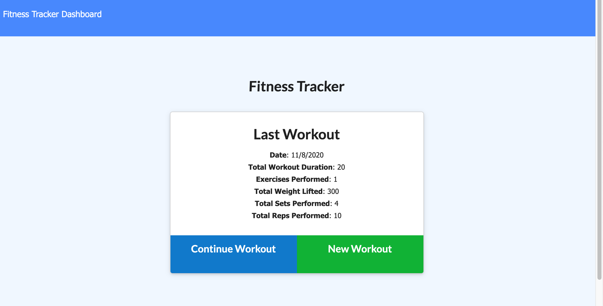
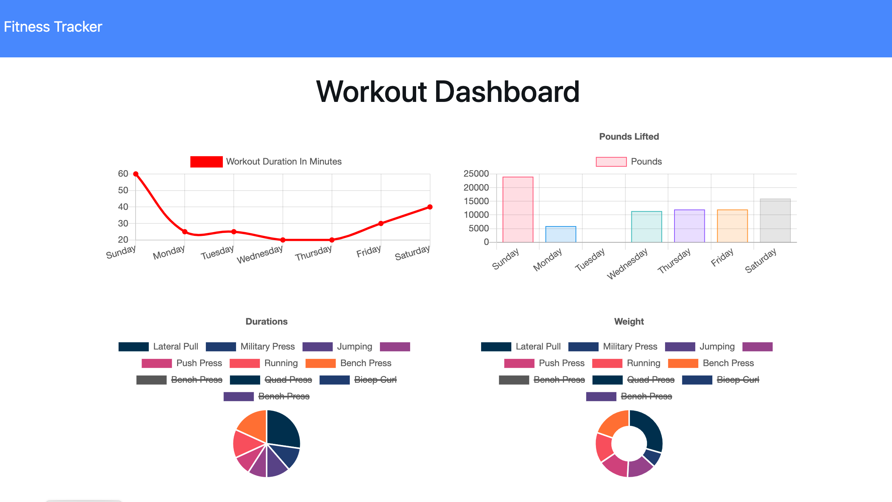

# Workout Tracker

* Deployed: https://polar-reaches-13844.herokuapp.com/?id=5faad8dd879e3f0017ab515c
* A workout tracker will be created to monitor daily activities. The users can update, track and visualize all workout data from dashboard. This project will require to create Mongo database with a Mongoose schema and handle routes with Express.

## User Story

* As a user, I want to be able to view, create and track daily workouts. I want to be able to log multiple exercises in a workout on a given day. I should also be able to track the name, type, weight, sets, reps, and duration of exercise. If the exercise is a cardio exercise, I should be able to track my distance traveled.

## Business Context

A consumer will reach their fitness goals more quickly when they track their workout progress.

## Acceptance Criteria

When the user loads the page, they should be given the option to create a new workout or continue with their last workout.

The user should be able to:

  * Add exercises to a previous workout plan.

  * Add new exercises to a new workout plan.

  * View the combined weight of multiple exercises on the `stats` page.
## Docs

  * [Set Up MongoDB Atlas](../04-Important/MongoAtlas-Setup.md)

  * [Deploy with Heroku and MongoDB Atlas](../04-Important/MongoAtlas-Deploy.md)

## Screenshot

* 
* 
